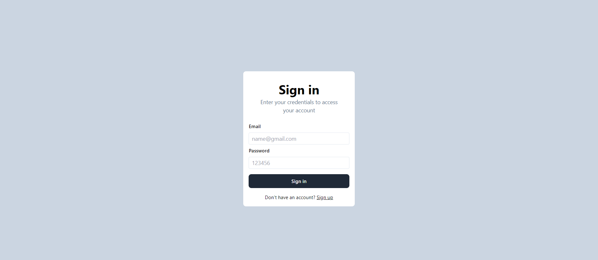
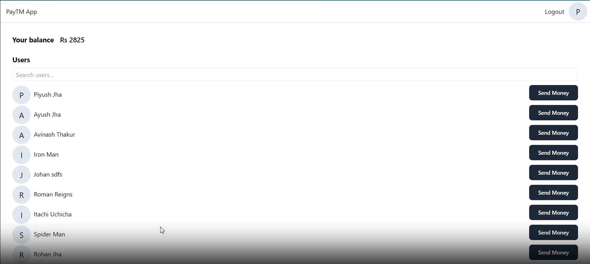
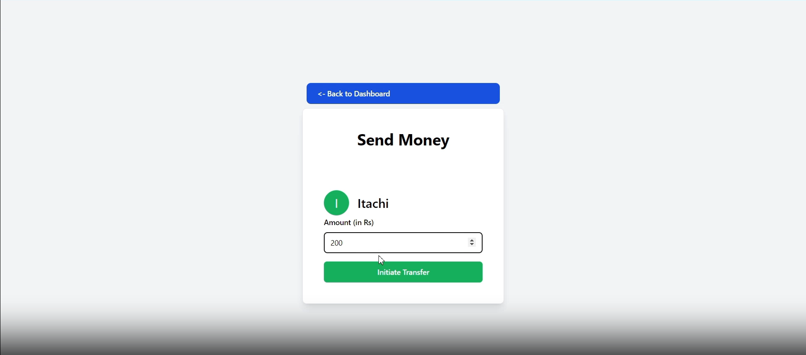
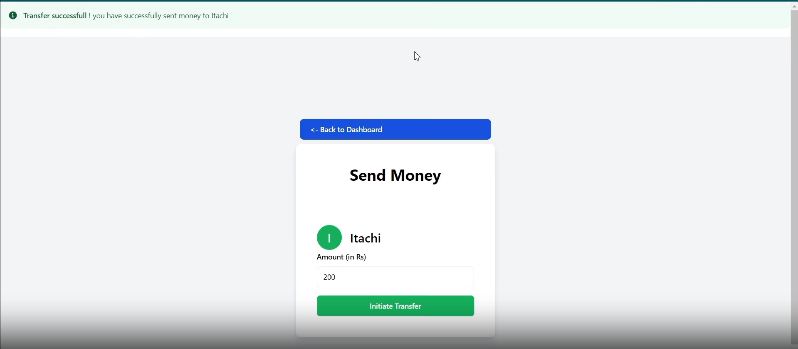

# Wallet App

A simple wallet app where users can send and receive money through transactions stored in a database.

### Screenshots

### Features Include

- 🔹 User signup
- 🔹 User signin
- 🔹 User Dashboard view
- 🔹 Users can send money to other users, ensuring secure transactions
- 🔹 Auto-login for previously logged users
- 🔹 Simple and beautiful UI

### Transaction Management

Transactions are managed using session functions to ensure all operations are executed as a single unit. This app adheres to the ACID properties:

- **Atomicity**: Transactions are completed in full or not at all. This is achieved using `session.startSession()`, where either the payment is fully completed (using `session.commitTransaction()`) or completely canceled (using `session.abortTransaction()`).
- **Consistency**: All transactions leave the database in a valid state.
- **Isolation**: Transactions operate independently, preventing interference.
- **Durability**: Completed transactions are stored permanently.

  
  
  
  

### Languages and Libraries Used

  
  
  
  
  
  
  

#### Created by [Ashish Patel](https://www.linkedin.com/in/ashishpatel3009)
